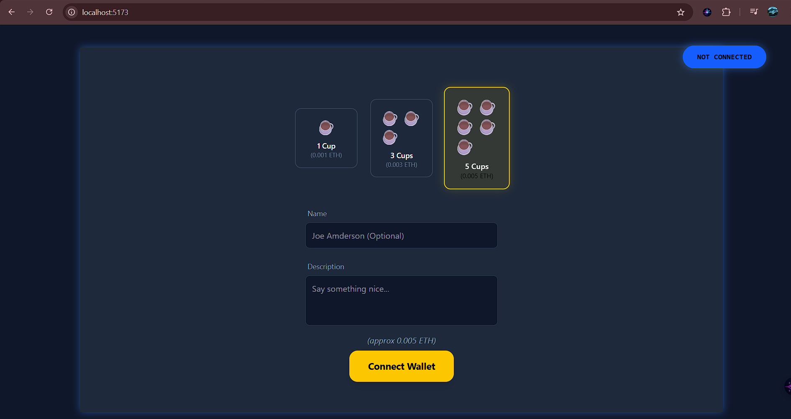

# Buy Me Coffee 

Short version: this is a tiny React + TypeScript + Vite app that lets people "buy you a coffee" on-chain (Sepolia testnet) with a fun UI.



## Why this repo exists

- It's a homework / proof-of-work project showing a simple dApp flow: connect wallet, pick a coffee, send ETH (or call a contract), and leave a short message.
- Built so friends can tip you coffee money without awkwardly sharing private keys or Venmo handles.

## Features

- **Connect MetaMask**: (or any injected `window.ethereum`) and show connection state.
- **Coffee Tier Picker**: Choose between 1, 3, or 5 cups (0.001 / 0.003 / 0.005 ETH shown in UI).
- **Personalized Messages**: Enter a name and a short message — gets sent along with the transaction.
- **Dual Payment Flows**: implemented in the hook: direct ETH transfer (`sendTx`) and contract call (`callContract`).

## Quick Run (Developer Machine)

**Bash**

```
# install deps
npm install

# dev server (Vite)
npm run dev
```

_Then open http://localhost:5173 (or the port Vite shows)._

## How it works (The Tech)

- `src/hooks/ConnectWallet.ts` — handles wallet connect, prepares signer, and exposes `sendTx` and `callContract` functions.
- `src/App.tsx` — main layout: connection button, cup picker, form, and the send button.
- `src/TransactionButton.tsx` — orchestrates UI states for connect / processing / completed and calls the hook to send funds.
- `src/FormDonor.tsx`, `src/cupsButton.tsx`, `src/connectedStatus.tsx` — small presentational components.
- `src/utils/utils.ts` — small helper `cn()` for merging Tailwind classes (uses `clsx` + `tailwind-merge`).

## Notes & Gotchas

- **Smart Contract Address**: used in `callContract` is hard-coded to: `0x01aec705EE6e10F2F0576692507CE1b4492DD7c1`.
- **Recipient Address**: Transactions in `sendTx` target a fixed address: `0x924592738241c649e57827eb9ffd2004879F1adC`.
- **Network**: This was built/demoed on **Sepolia** — treat addresses and values as examples for learning, not production.

------------------------------------by @0xJaadu--------------------------------
